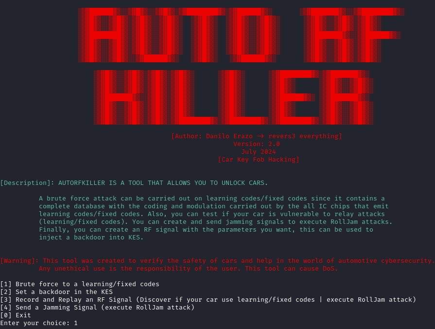

# AutoRFKiller
AUTORFKILLER IS A TOOL THAT ALLOWS YOU TO UNLOCK CARS.
          
A brute force attack can be carried out on learning codes/fixed codes since it contains a
complete database with the coding and modulation carried out by the all IC chips that emit
learning codes/fixed codes. Also, you can test if your car is vulnerable to relay attacks
(learning/fixed codes). You can create and send jamming signals to execute RollJam attacks.
Finally, you can create an RF signal with the parameters you want, this can be used to
inject a backdoor into KES.

