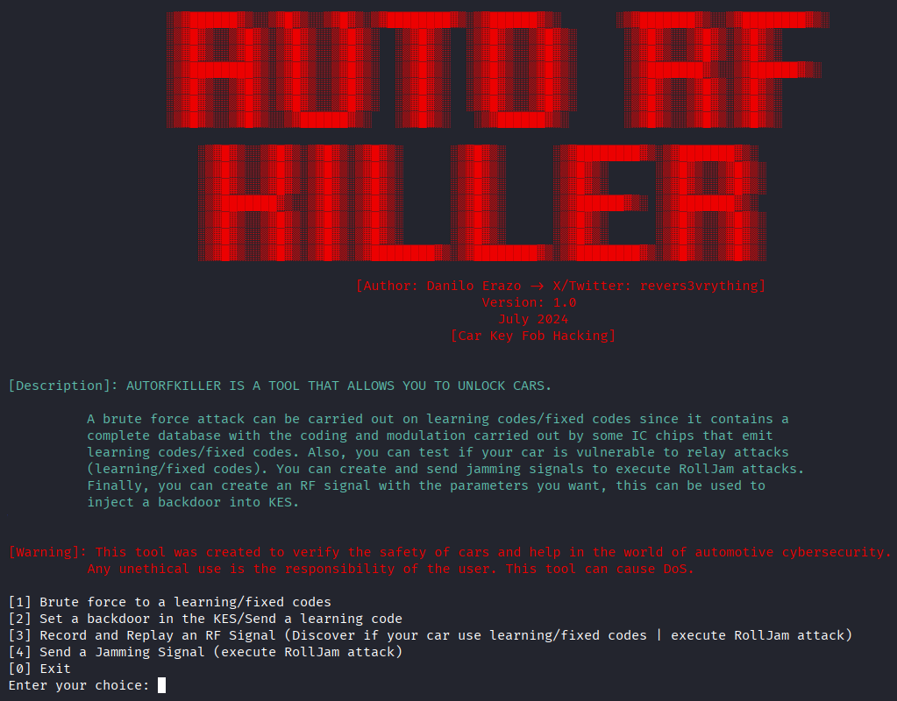

# AutoRFKiller

**AutoRFKiller v1** is an RF automotive security tool designed to help auditors, researchers and security enthusiasts evaluate car Keyless Entry Systems (KES). It supports identification and testing of three common KES schemes: **Rolling Code**, **Learning Code**, and **Fixed Code**. Also, this is the exploit for the CVEs: CVE-2025-6030 & CVE-2025-6029. Full research: https://revers3everything.com/unlocking-thousands-of-cars-by-exploiting-learning-codes-from-key-fobs/

> Presented at DEF CON 32: https://www.youtube.com/watch?v=es72oviu0Lg



---

## Table of contents

- [Overview](#overview)  
- [Installation](#installation)  
- [Requirements](#requirements)  
- [Features](#features)  
- [Usage notes & troubleshooting](#usage-notes--troubleshooting)  
- [Responsible use & legal notice](#responsible-use--legal-notice)  
- [Contributions](#contributions)  
---

## Overview

AutoRFKiller helps you identify and evaluate vulnerabilities in automotive keyless entry systems. The tool can detect whether a vehicle uses Rolling, Learning or Fixed code schemes and offers a set of testing features to demonstrate potential weaknesses for research and defensive purposes. This tool allow you to exploit the CVEs: CVE-2025-6030 and CVE-2025-6029.

**Important:** this project is intended for legitimate security research, testing on systems you own, or systems for which you have explicit written permission to test. See the **Responsible use & legal notice** section below.

---

## Installation

Recommended: install system dependencies, then set up a Python virtual environment.

```bash
# system packages (Debian/Ubuntu)
sudo apt update
sudo apt install -y gnuradio hackrf gr-osmosdr

# inside a Python virtual environment
python3 -m venv venv
source venv/bin/activate
pip install --upgrade pip
pip install PyQt5
```

> If you use a different SDR device, make sure the drivers and libraries for that device are installed.

---

## Requirements

- An SDR device capable of both transmit and receive (e.g. HackRF). AutoRFKiller has been tested with HackRF.
- Knowledge of the target key fob frequency (can be discovered with tools like Universal Radio Hacker (URH) or a Flipper Zero).
- Basic familiarity with RF concepts (modulation, sample rate, bandwidth).

---

## How to run
```bash
python3 autorfkiller.py
```

---

## Features

> The feature descriptions below describe the tool’s capabilities for defensive testing and research. Do not use these features on vehicles you do not own or do not have explicit authorization to test.

### 1) Brute-force for Learning/Fixed codes
Attempts to recover or brute-force fixed or learning code keyfobs when the chip/bit-format is known (or provided as a custom bit-length). Currently supports ASK modulation only, it will work against receivers that use ASK.

Proof-of-concept demos:  
- https://www.youtube.com/watch?v=_k86PKvsyG8  
- https://www.youtube.com/watch?v=r882QVCpzaE


---

### 2) Set a backdoor / Send a learning code
For KES receivers that support programming/learning mode, this feature demonstrates how a new learning code can be enrolled. The tool accepts codes in decimal or binary format. Entering programming mode is device-specific and may require interacting with the vehicle per the manufacturer's procedure.

Proof-of-concept demo:  
- https://www.youtube.com/watch?v=lYZspPDMpYQ


---

### 3) Record & Replay (replay / rollback testing)
Record RF transmissions and replay them to test for replayability. This helps identify systems vulnerable to simple replay attacks or rollback-style attacks. Select an appropriate sample rate (2 MHz is commonly sufficient). Default recording/replay durations are 10 seconds each. If you car was unlocked/locked and you only press one time the key fob buttom, you car is vulnerable to replay attack. You can proceed with the functionality [1] to unlock the car without MITM attack.

If you encounter `hackrf_open() failed: Resource busy (-1000)`, try closing the program, reconnecting the HackRF, and restarting the tool.

Proof-of-concept demo:  
- https://www.youtube.com/watch?v=8NWEWzdRy-Y


---

### 4) Transmit jamming signal
Transmit a jammer signal on a chosen frequency range supported by your SDR (e.g., HackRF: ~1 MHz – 6 GHz). Used in controlled experiments to study denial and mitigation behaviors.

Proof-of-concept demo:  
- https://www.youtube.com/watch?v=LsUQKD0ZTYA


---

### 5) RollJam (demonstration)
RollJam demonstrates a vulnerability class affecting some rolling-code systems. It is a man-in-the-middle style test that typically requires two SDRs and coordinated capture/jamming/replay. This is an advanced test intended for controlled lab environments or authorized assessments only. So, here you need two SDR devices and run the tool two times. The first one is to execute the feature "[4] Send a Jamming Signal" to inhibit the spectrum and at the same time you need to run the feature "[3] Record and Replay an RF Signal" to replay the signal that dont arrive to the car KES receive due to the jamming attack. This attack is know as rolljam and this is vulnerable all the cars with rolling code, this is a MITM attack.

Proof-of-concept demo:  
- https://www.youtube.com/watch?v=ZlIZA4SCC0s

---

## Usage notes & troubleshooting

- Always confirm you have the legal right to test the target system. Unauthorized testing of vehicles is illegal in most jurisdictions.
- Sample rate, modulation and timing parameters vary by vehicle/region start with conservative settings and consult the vehicle/keyfob documentation where available.
- Hardware conflicts: if the SDR is reported as busy, unplug/replug and restart the tool.
- Tests involving jamming or wideband transmission could interfere with critical radio systems; avoid testing near hospitals, airports, or public safety infrastructure.

---

## Responsible use & legal notice

AutoRFKiller is provided for security research, defensive testing, and educational purposes only. By using or distributing this software you agree to:

1. Only test systems that you **own** or for which you have **explicit written authorization**.  
2. Comply with all applicable laws and regulations in your jurisdiction.  
3. Never use the tool to facilitate theft, privacy invasion, or any activity that harms others.

The authors and maintainers of AutoRFKiller are **not responsible** for misuse. If you are unsure about the legality of a test, consult a lawyer or an authorized responsible disclosure channel before proceeding.

---

## Contributions

Contributions are welcome,bug reports, documentation improvements, and responsible research findings help make this project better.

Please contact: `revers3everything@gmail.com`
When contributing, include: a short description, reproduction steps (non-sensitive), and any relevant information.

---

## Author

Danilo Erazo - Independent Automotive Security Researcher, Bug Hunter
X: @revers3vrything
